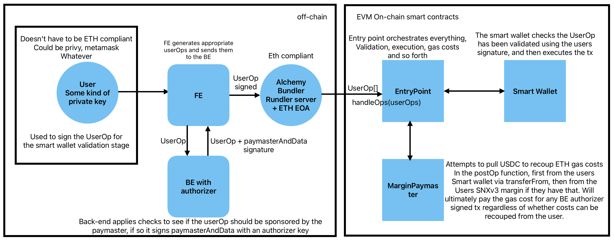

# Margin Paymaster

[![Github Actions][gha-badge]][gha] 
[![Foundry][foundry-badge]][foundry] 
[![License: GPL-3.0][license-badge]][license]

[gha]: https://github.com/Kwenta/foundry-scaffold/actions
[gha-badge]: https://github.com/Kwenta/foundry-scaffold/actions/workflows/test.yml/badge.svg
[foundry]: https://getfoundry.sh/
[foundry-badge]: https://img.shields.io/badge/Built%20with-Foundry-FFDB1C.svg
[license]: https://opensource.org/license/GPL-3.0/
[license-badge]: https://img.shields.io/badge/GitHub-GPL--3.0-informational

An ERC-4337 compliant custom Paymaster contract (`MarginPaymaster`) which sponsors optimistically sponsors transactions signed by a privileged actor, the `authorizer`.

The `MarginPaymaster` will attempt to recoup gas costs in USDC from a users smart wallet account and failing that their SNX-V3 margin.

You can see here a visual outlining the full ERC-4337 flow with our MarginPaymaster:



## Contracts

> `tree src/`

```
src
├── MarginPaymaster.sol
├── interfaces
│   └── external
│       ├── IEngine.sol
│       ├── INftModule.sol
│       ├── IPerpsMarketProxy.sol
│       ├── IUniswapV3Pool.sol
│       ├── IV3SwapRouter.sol
│       └── IWETH9.sol
└── libraries
    ├── FullMath.sol
    ├── OracleLibrary.sol
    └── TickMath.sol
```

## Tests

1. Follow the [Foundry guide to working on an existing project](https://book.getfoundry.sh/projects/working-on-an-existing-project.html)

2. Build project

```
npm run compile
```

3. Create an `.env` file using the `.env.example` file as a template

4. Execute tests (requires rpc url(s) to be set in `.env`)

```
npm run test
```

4. Run specific test

```
forge test -vv --fork-url $(grep BASE_URL .env | cut -d '=' -f2) --mt TEST_NAME
```

## Deployment Addresses

> See `deployments/` folder

1. Optimism deployments found in `deployments/Optimism.json`
2. Optimism Goerli deployments found in `deployments/OptimismGoerli.json`
3. Base deployments found in `deployments/Base.json`
4. Base Goerli deployments found in `deployments/BaseGoerli.json`

## Audits

> See `audits/` folder

1. Internal audits found in `audits/internal/`
2. External audits found in `audits/external/`
